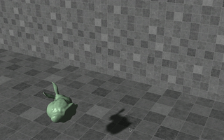
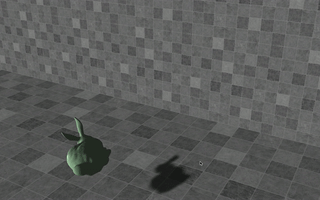

# GAMES103 - HW1 Angry Bunny

### Impulse



### Shape Matching



## Assignment Source：

- [Lab1.pdf](./lab1.pdf)
- [bunny.unitypackage](https://github.com/games-webinar/GAMES103/raw/main/HW1/%E4%BD%9C%E4%B8%9A1%EF%BC%9Abunny.unitypackage)

## Assignment Analysis

- how to write a rigid body dynamics solver?
- the bunny initially does rotational motion only at its starting position [0, 0.6, 0]; after the player presses ‘l’, the bunny will be launched and start to perform both translational and rotational motion;
- when the player presses ‘r’, the bunny will return to its starting position, waiting for the next launch.

### Tasks

**1.1 Position update**

- In the Update function, implement the update of the position and the orientation by Leapfrog integration.
- Disable the linear motion and the position update, if launched is false.
  ```csharp
  if(!launched) return;
  ```

**1.2 Velocity update**

- Calculate the gravity force and use it to update the velocity.
- To produce damping effects, you can multiply the velocities by linear and angular decay factors: $\bold v = c^{linear\_decay} \bold v$ and $\bold \omega = c^{angular\_decay} \bold \omega$
  ```csharp
  Vector3 gravity = new Vector3(0.0f, -9.8f, 0.0f);
  // Part I: Update velocities
  v = linear_decay * (v + dt * gravity);
  w *= angular_decay;
  ```

**1.3 Collision detection**

- In your **Collision_Impulse** function, calculate the position and the velocity of every mesh vertex.
- Use them to determine whether the vertex is in collision with the floor

  ```csharp
  Matrix4x4 R = Matrix4x4.Rotate(transform.rotation);

  int count = 0; // the collision vertices number
  Vector3 collisionV = new Vector3(0, 0, 0);
  Vector3 collisionP = new Vector3(0, 0, 0);
  Vector3 c = transform.position; // the position of the  center of mass
  // Rigid Detection
  for(int i = 0; i < vertices.Length; i++) {
      // test if there is a collision
      Vector3 R_r_i = R * vertices[i];
      Vector3 x_i = c + R_r_i;
      float distance = Get_Signed_Distance(x_i, P, N); //  signed distance
      if(distance < 0) {
          Vector3 w_R_i = Get_Cross_Matrix(w) * R_r_i;
          Vector3 v_i = v + w_R_i;
          if (Get_Dot_Product(v_i, N) < 0) {
              collisionV += v_i;
              collisionP += R_r_i;
              count++;
          }
      }
  }
  ```

- If so, add it to the sum and then compute the average of all colliding vertices.

  ```csharp
  // Rigid Response
  if(count > 0) {
      // average these collision vertices
      collisionV /= count;
      collisionP /= count;

      ......
  }
  ```

\***\*1.4 Collision response\*\***

- In the same function, apply the **impulse-based method** to calculate the proper impulse **j** for the average colliding position.

  ```csharp
  // Rigid Response
  if(count > 0) {
      // average these collision vertices
      collisionV /= count;
      collisionP /= count;

      // compute the v_i_new
      Vector3 v_N = Get_Dot_Product(collisionV, N) * N;
      Vector3 v_T = collisionV - v_N;
      // compute the friction attenuation
      float a = Mathf.Max(0, 1 - u_T * (1 + restitution) *   v_N.magnitude / v_T.magnitude, 0);
      Vector3 v_N_new = - restitution * v_N;
      Vector3 v_T_new = - a * v_T;
      Vector3 v_new = v_N_new + v_T_new;

      // compute the impulse J
      Matrix4x4 R_r_i_c = Get_Cross_Matrix(collisionP);
      Matrix4x4 I = Matrix4x4.identity;
      Matrix4x4 K = Get_Sub_Two_Matrix(Get_Matrix_Mul_Num(I,   mass_inverse), R_r_i_c * I_ref_inverse * R_r_i_c);
      Vector3 J = K.inverse * (v_new - collisionV);
      .....
  }
  ```

- You then update the linear velocity and the angular velocity by **j** accordingly.
  ```csharp
  // update v and w
  v = v + mass_inverse * J;
  Vector3 d_w = I_ref_inverse * R_r_i_c * J;
  w = w + d_w;
  // decrease the restitution to reduce oscillation.
  restitution *= 0.5f;
  ```

**1.5 Collision with the wall**

**Bonus: Shape Matching**

- This solver is essentially a particle system, in which every particle has its own position and moves with its own velocity.

  ```csharp
  // Update
  //Step 1: run a simple particle system.
  for(int i=0; i<V.Length; i++)
  {
    V[i] = linear_decay * (V[i] + dt * gravity);
    X[i] += dt * V[i];
  }
  //Step 2: Perform simple particle collision.
  Collision(1/dt, new Vector3(0, 0.01f, 0), ne  Vector3(0, 1, 0));
  Collision(1/dt, new Vector3(2, 0, 0), new Vecto  (-1, 0, 0));
  ```

  ```csharp
  void Collision(float inv_dt, Vector3 P, Vector3 N) {
  	for (int i = 0; i < V.Length; i++) {
  		Vector3 x_p = X[i] - P;
  		float X_proj = Dot_Product(x_p, N);
  		if(X_proj < epsilon) {
  			if(Dot_Product(V[i], N) < 0) {
  				Vector3 V_N = Dot_Product(V[i], N) * N;
  				Vector3 V_T = V[i] - V_N;
  				float a = Mathf.Max(0, 1 - u_T * (1 +restitution) * V_N.magnitude / V_Tmagnitude);
  				Vector3 V_N_new = -restitution * V_N;
  				Vector3 V_T_new = a * V_T;
  				V[i] = V_N_new + V_T_new;
  				X[i] = X[i] + Mathf.Abs(X_proj) * N *coeff;
  				restitution *= 0.5f;
  			}
  		}
  	}

  }
  ```

- The secret is in the **polar decomposition function** for you to extract rotation out of a linear transformation estimation.

  ```csharp
  //Shape Matching (rotation)
  Matrix4x4 A = Matrix4x4.zero;
  for(int i = 0; i < Q.Length; i+=5) {
  	Vector3 r_i = X[i] - c;
  	A[0, 0] += r_i[0] * Q[i][0];
  	A[0, 1] += r_i[0] * Q[i][1];
  	A[0, 2] += r_i[0] * Q[i][2];
  	A[1, 0] += r_i[1] * Q[i][0];
  	A[1, 1] += r_i[1] * Q[i][1];
  	A[1, 2] += r_i[1] * Q[i][2];
  	A[2, 0] += r_i[2] * Q[i][0];
  	A[2, 1] += r_i[2] * Q[i][1];
  	A[2, 2] += r_i[2] * Q[i][2];
  }
  A[3,3] = 1;
  A *= QQt.inverse;
  Matrix4x4 R = Get_Rotation(A);
  Update_Mesh(c, R, 1/dt);
  ```

  ```csharp
  // Update the mesh vertices according to translation c and rotation R.
  // It also updates the velocity.
  void Update_Mesh(Vector3 c, Matrix4x4 R, float inv_dt)
  {
  	for(int i=0; i<Q.Length; i++)
  {
  	Vector3 x=(Vector3)(R*Q[i])+c
  	V[i]+=(x-X[i])*inv_dt;
  	X[i]=x;
  }
  Mesh mesh = GetComponent<MeshFilter>().mesh;
  mesh.vertices=X;
  ```
