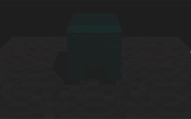

# GAMES103 - HW3 Bouncy House



## Assignment Source：

- [Lab3.pdf](./lab3.pdf)
- [house.unitypackage](https://community-1252524126.file.myqcloud.com/file/ecommunity-83572220.unitypackage)

## Assignment Analysis

- implement **the finite element method** for elastic body simulation.
- the simple `St. Venant-Kirchhoff (StVK)` model for elasticity
- use explicit time integration

### Tasks:

**1.1 Basic setup**

- In the Update function, write the simulation of the house as **a simple particle system**.
- Every vertex has its own **position x** and **velocity v**, and the velocity is under the influence of **gravity**.
  ```csharp
  for(int i=0 ;i<number; i++)
  {
  	//TODO: Add gravity to Force.
  	Force[i] = new Vector3(0, -9.8f * mass, 0);
  }
  //TODO: Update X and V here.
  V[i] = (V[i] + dt * Force[i] / mass) * damp;
  X[i] = X[i] + dt * V[i];
  ```
- Please also implement **frictional contact between every vertex and the floor**.
  ```csharp
  //TODO: (Particle) collision with floor.
  if(X[i].y < -3.0f) {
  	V[i].x = 0;
  	V[i].z = 0;
  	V[i].y += (-3.0f - X[i].y) / dt;
  	X[i].y = -3.0f;
  }
  ```
- Since this project uses a relatively small time step, **the Update function calls Update ten times**.
- After that, the function contains the code to send vertex positions into the house mesh for display.

**1.2 Edge matrices**

- Next, write a **Build Edge Matrix function** that returns **the edge matrix of a tetrahedron**.

  ```csharp
  Matrix4x4 Build_Edge_Matrix(int tet)
  {
  Matrix4x4 ret=Matrix4x4.zero;
  //TODO: Need to build edge matrix here.
  ret[0, 0] = X[Tet[tet * 4 + 1]].x - X[Tet[tet * 4 + 0]].x;
  ret[1, 0] = X[Tet[tet * 4 + 1]].y - X[Tet[tet * 4 + 0]].y;
  ret[2, 0] = X[Tet[tet * 4 + 1]].z - X[Tet[tet * 4 + 0]].z;
  ret[3, 0] = 0;

  ret[0, 1] = X[Tet[tet * 4 + 2]].x - X[Tet[tet * 4 + 0]].x;
  ret[1, 1] = X[Tet[tet * 4 + 2]].y - X[Tet[tet * 4 + 0]].y;
  ret[2, 1] = X[Tet[tet * 4 + 2]].z - X[Tet[tet * 4 + 0]].z;
  ret[3, 1] = 0;

  ret[0, 2] = X[Tet[tet * 4 + 3]].x - X[Tet[tet * 4 + 0]].x;
  ret[1, 2] = X[Tet[tet * 4 + 3]].y - X[Tet[tet * 4 + 0]].y;
  ret[2, 2] = X[Tet[tet * 4 + 3]].z - X[Tet[tet * 4 + 0]].z;
  ret[3, 2] = 0;

  ret[0, 3] = 0;
  ret[1, 3] = 0;
  ret[2, 3] = 0;
  ret[3, 3] = 1;

  return ret;
  }
  ```

- In the Start function, call this function to calculate inv_Dm, the inverse of the reference edge matrix for every tetrahedron.
  ```csharp
  //TODO: Need to allocate and assign inv_Dm
  inv_Dm = new Matrix4x4[tet_number];
  for (int tet = 0; tet < tet_number; tet++) {
  	inv_Dm[tet] = Build_Edge_Matrix(tet).inverse;
  }
  ```

**1.3 Elastic Forces**

- Follow the slides to implement the elastic forces, based on the finite element method.
- Specifically, for every tetrahedron, calculate the deformation gradient $\bold F$
  ```csharp
  Matrix4x4 F = Build_Edge_Matrix(tet) * inv_Dm[tet];
  ```
- the Green strain $\bold G = \frac{1}{2}(\bold F^T\bold F - \bold I)$

  ```csharp
  Matrix4x4 G = F.transpose * F;
  G[0, 0] -= 1;
  G[1, 1] -= 1;
  G[2, 2] -= 1;
  for (int i = 0; i < 3; i++) {
  	for (int j = 0; j < 3; j++) {
  		G[i, j] *= 0.5f;
  	}
  }
  ```

- the second Piola-Kirchhoff stress $\bold S = 2s_1\bold G + s_0tr(\bold G)\bold I$
  ```csharp
  Matrix4x4 S = Matrix4x4.zero;
  for (int i = 0; i < 3; i++) {
  	for (int j = 0; j < 3; j++) {
  		S[i, j] = stiffness_1 * 2 * G[i, j];
  	}
  }
  S[0, 0] += stiffness_0 * (G[0, 0] + G[1, 1] + G[2, 2]);
  S[1, 1] += stiffness_0 * (G[0, 0] + G[1, 1] + G[2, 2]);
  S[2, 2] += stiffness_0 * (G[0, 0] + G[1, 1] + G[2, 2]);
  ```
- and finally the forces for the four vertices.

  ```csharp
  Matrix4x4 result = F * S * inv_Dm[tet].transpose;

  float scale = -1 / (inv_Dm[tet].determinant * 6);
  Force[Tet[tet * 4 + 0]].x -= scale * (result[0, 0] +  result[0, 1] + result[0, 2]);
  Force[Tet[tet * 4 + 0]].y -= scale * (result[1, 0] +  result[1, 1] + result[1, 2]);
  Force[Tet[tet * 4 + 0]].z -= scale * (result[2, 0] +  result[2, 1] + result[2, 2]);
  Force[Tet[tet * 4 + 1]].x += scale * result[0, 0];
  Force[Tet[tet * 4 + 1]].y += scale * result[1, 0];
  Force[Tet[tet * 4 + 1]].z += scale * result[2, 0];
  Force[Tet[tet * 4 + 2]].x += scale * result[0, 1];
  Force[Tet[tet * 4 + 2]].y += scale * result[1, 1];
  Force[Tet[tet * 4 + 2]].z += scale * result[2, 1];
  Force[Tet[tet * 4 + 3]].x += scale * result[0, 2];
  Force[Tet[tet * 4 + 3]].y += scale * result[1, 2];
  Force[Tet[tet * 4 + 3]].z += scale * result[2, 2];
  ```

**1.4 Laplacian smoothing**

- Since we use explicit time integration, the simulation is susceptible to numerical instability.
- Damping implemented in 1.1 is crucial to numerical stability, but it cannot eliminate high-frequency oscillation.
- To address this problem, please implement **Laplacian smoothing** over the vertex velocities.
- To do so, for every vertex, sum up all of its neighbor’s velocities and then blend it into its own velocity.

  ```csharp
  void Smooth_V() {
  for (int i = 0; i < number; i++) {
  	V_sum[i] = new Vector3(0, 0, 0);
  	V_num[i] = 0;
  }

  for (int tet = 0; tet < tet_number; tet++) {
  	Vector3 sum = V[Tet[tet * 4 + 0]] + V[Tet[tet * 4 + 1]] + V[Tet[tet * 4 + 2]] + V[Tet[tet * 4 + 3]];
  	V_sum[Tet[tet * 4 + 0]] += sum;
  	V_sum[Tet[tet * 4 + 1]] += sum;
  	V_sum[Tet[tet * 4 + 2]] += sum;
  	V_sum[Tet[tet * 4 + 3]] += sum;
  	V_num[Tet[tet * 4 + 0]] += 4;
  	V_num[Tet[tet * 4 + 1]] += 4;
  	V_num[Tet[tet * 4 + 2]] += 4;
  	V_num[Tet[tet * 4 + 3]] += 4;
  }

  for (int i = 0; i < number; i++) {
  	V[i] = 0.9f * V[i] + 0.1f * V_sum[i] / V_num[i];
  }
  }
  ```

**Bonus: TODO**

- An alternative way of calculating the stress is to treat the strain energy density as a function of matrix invariants, or principal stretches.
- This allows us to more conveniently adopt arbitrary hyperelastic models.
