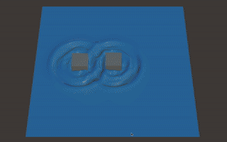

# GAMES103 - HW4 Pool Ripples



## Assignment Source：

- [Lab4.pdf](./lab4.pdf)
- [wave.unitypackage](./wave.unitypackage)

## Assignment Analysis

- how to solve a simplified shallow wave model to simulate ripples of a water pool and experience the two-way coupling technique
- two jobs:
  - to simulate ripple effects by adjusting the $y$ values of the mesh vertices;
  - to simulate proper interactions between blocks and water surface.

### Tasks:

**1.1 Basic setup**:

- At the beginning of the `update` function, load the heights (the $y$ values) of the vertices into $h$.

```csharp
for(int i = 0; i < size; i++) {
	for (int j = 0; j < size; j++) {
		h[i, j] = X[i * size + j].y;
	}
}
```

- At the end of the `update` function, set h back into the heights of the vertices. Remember to recalculate the mesh normal in the end.

```csharp
for (int i = 0; i < size; i++) {
	for (int j = 0; j < size; j++) {
		X[i * size + j].y = h[i,j];
	}
}
mesh.vertices = X;

mesh.RecalculateNormals();
```

**1.2 User Interaction**

- When the player hits the `‘r’` key, add a random water drop into the pool.

  - To do so, you can increase the column `h[i,j]` by `r`, in which i, j and r are all randomly determined.

    ```csharp
    int i = (int)(Random.Range(0.0f, 1.0f) * size);
    int j = (int)(Random.Range(0.0f, 1.0f) * size);

    if (i < 1) i = 1;
    if (j < 1) j = 1;
    if (i >= size - 1) i = size - 2;
    if (j >= size - 1) j = size - 2;

    float v = 0.2f * Random.Range(0.5f, 1.0f) * 4;

    h[i,j] += v;
    ```

  - One problem is that it can cause more water volume to be poured into the pool over time, according to the shallow wave model.
  - To solve this problem, simply **deduce the same amount (r) from the surrounding columns** so the total volume stays the same.
    ```csharp
    h[i - 1, j] -= v/4;
    h[i + 1, j] -= v/4;
    h[i, j - 1] -= v/4;
    h[i1, j + 1] -= v/4;
    ```

\***\*\*\*\*\***1.3 Ripples\***\*\*\*\*\***

- In the update function, call the `Shallow_Wave` function eight times
  ```csharp
  for(int l = 0; l < 8; l++)
  {
  	Shallow_Wave(old_h, h, new_h);
  }
  ```
- In the `Shallow_Wave` function, compute the new height `new_h` as:

$$
h_{i,j}^{new} \leftarrow h_{i,j} + (h_{i,j} - h_{i,j}^{old}) * damping + (h_{i-1,j} + h_{i+1,j} + h_{i,j-1} +h_{i,j+1}-4h_{i,j})*rate
$$

```csharp
//Step 1:
// Compute new_h based on the shallow wave model.
for (int i = 0; i < size; i++) {
    for (int j = 0; j < size; j++) {
        new_h[i, j] = h[i, j] + (h[i, j] - old_h[i, j]) * damping;

        if (i != 0) 	   new_h[i, j] += (h[i - 1, j] - h[i, j]) * rate;
        if (i != size - 1) new_h[i, j] += (h[i + 1, j] - h[i, j]) * rate;
        if (j != 0) 	   new_h[i, j] += (h[i, j - 1] - h[i, j]) * rate;
        if (j != size - 1) new_h[i, j] += (h[i, j + 1] - h[i, j]) * rate;

        old_h[i,j]=h[i,j];
    }
}
```

- in which $damping = 0.996$ and $rate = 0.005$. Specify `Neumann` boundary conditions on the grid boundary.
- After you compute $h_{i,j}^{new}$ for all of the columns, set $h_{i,j} = h_{i,j}^{new}$ and $h_{i,j}^{old} = h_{i,j}$. Now you should see waves being simulated.
  ```csharp
  //Step 3
  // old_h <- h; h <- new_h;
  for (int i  = 0; i < size; i++) {
      for (int j = 0; j < size; j++) {
          h[i, j] = new_h[i, j];
          old_h[i, j] = h[i, j];
      }
  }
  ```

\***\*\*\*\*\***1.4 One-way coupling\***\*\*\*\*\***

- For simplicity, let’s consider **one-way coupling** from blocks to water first.
- Based on block positions, you can figure out the columns in contact with the blocks, labeled out as `mask`, and **the desired heights of these columns**, stored in an array `low_h`.

  ```csharp
  //TODO: for block 1, calculate low_h. how?
  GameObject Cube = GameObject.Find("Cube");
  Vector3 cube_p = Cube.transform.position;
  Mesh cube_mesh = Cube.GetComponent<MeshFilter>().mesh;

  int li = (int)((cube_p.x + 5.0f) * 10) - 3;
  int ui = (int)((cube_p.x + 5.0f) * 10) + 3;
  int lj = (int)((cube_p.z + 5.0f) * 10) - 3;
  int uj = (int)((cube_p.z + 5.0f) * 10) + 3;
  Bounds bounds = cube_mesh.bounds;

  for (int i = li - 3; i <= ui + 3; i++) {
      for (int j = lj - 3; j <= uj + 3; j++) {
          if (i >= 0 && j >= 0 && i < size && j < size) {
              Vector3 p = new Vector3(i * 0.1f - size * 0.05f, -11, j * 0.1f - size * 0.05f);
              Vector3 q = new Vector3(i * 0.1f - size * 0.05f, -10, j * 0.1f - size * 0.05f);
              p = Cube.transform.InverseTransformPoint(p);
              q = Cube.transform.InverseTransformPoint(q);

              Ray ray = new Ray(p, q - p);
              float dist = 99999;
              bounds.IntersectRay(ray, out dist);

              low_h[i, j] = -11 + dist; // cube.p.y - 0.5f;
          }
      }
  }
  ```

- Use the conjugate gradient (`CG`) method to solve the Poisson equation $\bold A\bold v = b$,
- in which $\bold A$ is the **masked Laplacian matrix** and $b = (h_{new} − h_{low})/rate$.
- Remember to set the solvable region as well to optimize the performance.
  ```csharp
  //TODO: then set up b and cg_mask for conjugate gradient.
  for (int i = 0; i < size; i++) {
  for (int j = 0; j < size; j++) {
  if (low_h[i, j] > h[i, j]) {
  b[i, j] = 0;
  vh[i, j] = 0;
  cg_mask[i, j] = false;
  } else {
  cg_mask[i, j] = true;
  b[i, j] = (new_h[i, j] - low_h[i, j]) / rate;
  }
  }
  }
  //TODO: Solve the Poisson equation to obtain vh (virtual height).
  Conjugate_Gradient(cg_mask, b, vh, li - 1, ui + 1, lj - 1, uj + 1);
  ```

  ```
- The result $\bold v$ can be intuitively understood as virtual pressure pushing water out of a column.
- If you use it directly, it can cause very large and unrealistic waves, fundamentally due to explicit integration used for ripple update.
- To solve this problem, simply diminish it as $\bold v ← \gamma\bold v$ and finally renew $h_{i,j}^{new}$:
  $$
  h_{i,j}^{new} \leftarrow h_{i,j}^{new}  + (v_{i-1, j} + v_{i+1, j}+v_{i, j-1}+v_{i, j+1} - 4v_{i,j}) * rate
  $$
  Once you implement the above, you should now see the ripples caused by block movement.
  ```csharp
  //TODO: Diminish vh.
  for (int i = 0; i < size; i++) {
      for (int j = 0; j < size; j++) {
          if(cg_mask[i, j]) vh[i, j] *= gamma;
      }
  }
  //TODO: Update new_h by vh.
  for (int i  = 0; i < size; i++) {
      for (int j = 0; j < size; j++) {
          if (i != 0) 		new_h[i, j] += (vh[i - 1, j] - vh[i, j]) * rate;
          if (i != size - 1) 	new_h[i, j] += (vh[i + 1, j] - vh[i, j]) * rate;
          if (j != 0) 		new_h[i, j] += (vh[i, j - 1] - vh[i, j]) * rate;
          if (j != size - 1) 	new_h[i, j] += (vh[i, j + 1] - vh[i, j]) * rate;
      }
  }
  ```

\***\*\*\*\*\*\*\***Bonus:\***\*\*\*\*\*\*\***

- fully implement two-way coupling

```csharp
...
float t = 0.004f;
float mass = 10.0f;
Vector3 force = new Vector3(0, -mass * 9.8f, 0);
Vector3 torque = new Vector3(0, 0, 0);

for (int i = li - 3; i <= ui + 3; i++) {
    for (int j = lj - 3; j <= uj + 3; j++) {
        if (i >= 0 && j >= 0 && i < size && j < size) {
            ...

            if (vh[i, j] != 0) {
                Vector3 r = p + dist * (q - p) - cube_p;
                Vector3 f = new Vector3(0, vh[i, j], 0) * 4.0f;
                force += f;

                torque += Vector3.Cross(r, f);
            }
        }
    }
}
cube_v *= 0.99f;
cube_w *= 0.99f;
cube_v += force * t / mass;
cube_p += cube_v * t;
Cube.transform.position = cube_p;
cube_w += torque * t / (100.0f * mass);
Quaternion cube_q = Cube.transform.rotation;
Quaternion wq = new Quaternion(cube_w.x, cube_w.y, cube_w.z, 0);
Quaternion temp_q = wq * cube_q;
cube_q.x += 0.5f * t * temp_q.x;
cube_q.y += 0.5f * t * temp_q.y;
cube_q.z += 0.5f * t * temp_q.z;
cube_q.w += 0.5f * t * temp_q.w;
Cube.transform.rotation = cube_q;
```
